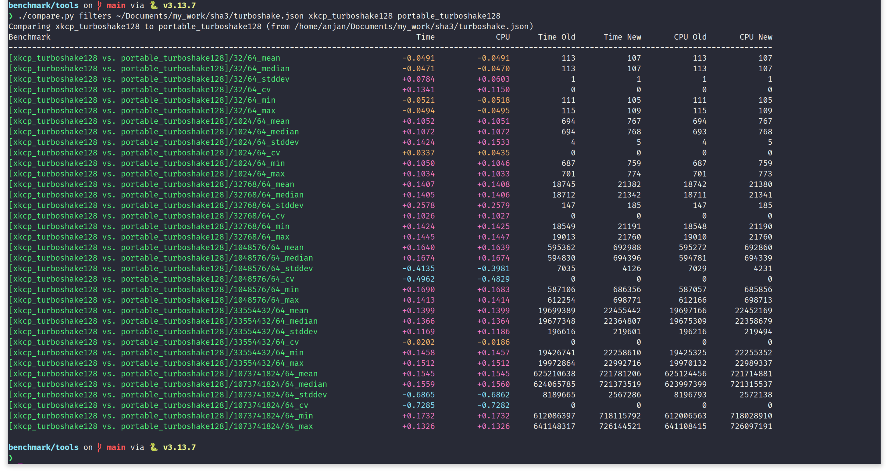

# sha3

`constexpr` SHA3: Keccak Permutation-based Hash and Extendable-Output Functions.

> [!NOTE]
> `constexpr`? Yes, you can evaluate message digest (MD) of any message, during program compilation time itself, given that the message is known at compile-time. This can be useful if you have to embed a message digest in program as a constant. Instead of hardcoding the MD as constant, the compiler can compute it for you. And you can run a `static_assert` against the computed value.

## Overview

SHA3 standard i.e. NIST FIPS 202, specifies four permutation-based hash functions and two eXtendable Output Functions (XOF), which are built on top of 24-rounds keccak-p[1600, 24] permutation. In IETF RFC 9861, two additional XOFs are defined based on 12-rounds keccak-p[1600, 12] permutation. The round reduced keccak permutation almost doubles the performance of TurboSHAKE compared to the original SHAKE XOFs.

These hash functions and extendable output functions are commonly used in various post-quantum cryptography algorithms (i.e. those used for public key encryption, key establishment mechanism and digital signature). Some of which are already standardized (e.g. ML-KEM, ML-DSA, SLH-DSA etc.) by NIST, some are waiting to be standardized (e.g. FN-DSA) or some are still competing. We implement SHA3 specification as a **header-only fully constexpr C++ library**, so that we can use it as a modular dependency (say pinned to a specific commit using git submodule) in libraries, where we implement various PQC schemes. We follow NIST FIPS 202 @ <https://dx.doi.org/10.6028/NIST.FIPS.202> and RFC 9861 @ <https://datatracker.ietf.org/doc/rfc9861>.

Following algorithms (with flexible interfaces) are implemented in `sha3` library.

Algorithm | Input | Output | Behaviour | Namespace + Header
--- | :-: | :-: | :-: | --:
SHA3-224 | N ( >=0 ) -bytes message | 28 -bytes digest | Given N -bytes input message, this routine computes 28 -bytes sha3-224 digest, while *(incrementally)* consuming message into Keccak[448] sponge. | [`sha3_224::sha3_224_t`](./include/sha3/sha3_224.hpp)
SHA3-256 | N ( >=0 ) -bytes message | 32 -bytes digest | Given N -bytes input message, this routine computes 32 -bytes sha3-256 digest, while *(incrementally)* consuming message into Keccak[512] sponge. | [`sha3_256::sha3_256_t`](./include/sha3/sha3_256.hpp)
SHA3-384 | N ( >=0 ) -bytes message | 48 -bytes digest | Given N -bytes input message, this routine computes 48 -bytes sha3-384 digest, while *(incrementally)* consuming message into Keccak[768] sponge. | [`sha3_384::sha3_384_t`](./include/sha3/sha3_384.hpp)
SHA3-512 | N ( >=0 ) -bytes message | 64 -bytes digest | Given N -bytes input message, this routine computes 64 -bytes sha3-512 digest, while *(incrementally)* consuming message into Keccak[1024] sponge. | [`sha3_512::sha3_512_t`](./include/sha3/sha3_512.hpp)
SHAKE128 | N ( >=0 ) -bytes message | M ( >=0 ) -bytes output | Given N -bytes input message, this routine squeezes arbitrary ( = M ) number of output bytes from Keccak[256] sponge, which has already *(incrementally)* absorbed input bytes. | [`shake128::shake128_t`](./include/sha3/shake128.hpp)
SHAKE256 | N ( >=0 ) -bytes message | M ( >=0 ) -bytes digest | Given N -bytes input message, this routine squeezes arbitrary ( = M ) number of output bytes from Keccak[512] sponge, which has already *(incrementally)* absorbed input bytes. | [`shake256::shake256_t`](./include/sha3/shake256.hpp)
TurboSHAKE128 | N ( >=0 ) -bytes message | M ( >=0 ) -bytes output | Given N -bytes input message, this routine squeezes arbitrary ( = M ) number of output bytes from Keccak[256] sponge, which has already *(incrementally)* absorbed input bytes. **It is faster than SHAKE128, because it is powered by 12-rounds keccak permutation.** | [`turboshake128::turboshake128_t`](./include/sha3/turboshake128.hpp)
TurboSHAKE256 | N ( >=0 ) -bytes message | M ( >=0 ) -bytes output | Given N -bytes input message, this routine squeezes arbitrary ( = M ) number of output bytes from Keccak[512] sponge, which has already *(incrementally)* absorbed input bytes. **It is faster than SHAKE256, because it is powered by 12-rounds keccak permutation.** | [`turboshake256::turboshake256_t`](./include/sha3/turboshake256.hpp)

XKCP is the state-of-the-art C library implementation, for all common constructions based on keccak permutation. It is available @ <https://github.com/XKCP/XKCP>. Following screen capture shows a performance comparison of generic and portable TurboSHAKE128 XOF, implemented in this library, against the baseline of XKCP's optimized TurboSHAKE128 implementation. To compare performance of TurboSHAKE128, for both short and long messages, we absorb messages of variable length, starting from 32B to 1GB, with a multiplicative jump factor of 32, while squeezing a fixed length output of 64B.

Benchmark comparison shows a clear and consistent trend of this portable implementation taking ~(10-15)% more time compared to XKCP.

> [!IMPORTANT]
> This performance comparison was carried out on a `12th Gen Intel(R) Core(TM) i7-1260P` machine, running `Linux 6.17.0-6-generic` kernel. The benchmark executable was compiled using `GCC-15.2.0`, with optimization options `-O3 -march=native -flto`. For XKCP, we built the library at git commit `e7a08f7baa3d43d64f5c21e641cb18fe292f2b75`. We used google-benchmark's benchmark comparison tool @ <https://github.com/google/benchmark/blob/v1.9.4/docs/tools.md> for easily comparing JSON dump.



Ideally, one should just go ahead with XKCP. Though, one edge this portable implementation of `sha3` has over XKCP - it is fully `constexpr`. In following code snippet, we compute SHA3-256 message digest (MD) of a compile-time known string, in program compilation time itself. The MD is checked using a static assertion. This header-only lightweight library allows you to embed SHA3-256 `MD` as a constant, which is computed by the compiler. It's not hard-coded.

```cpp
#include "sha3/sha3_256.hpp"
#include <array>
#include <cstdint>
#include <cstdlib>
#include <string_view>

// Compile-time hex character to nibble conversion.
constexpr uint8_t
hex_digit(char chr)
{
  if (chr >= '0' && chr <= '9') return static_cast<uint8_t>(chr - '0');
  if (chr >= 'a' && chr <= 'f') return static_cast<uint8_t>(chr - 'a' + 10);
  if (chr >= 'A' && chr <= 'F') return static_cast<uint8_t>(chr - 'A' + 10);
  return 0;
}

// Given a hex encoded string of length 2*L, parse it as a byte array of length L.
template<size_t L>
constexpr std::array<uint8_t, L>
from_hex(std::string_view hex)
{
  std::array<uint8_t, L> res{};
  for (size_t i = 0; i < L; i++) {
    res[i] = static_cast<uint8_t>((hex_digit(hex[2 * i]) << 4) | hex_digit(hex[(2 * i) + 1]));
  }
  return res;
}

// Given a string_view, interpret its raw bytes as a uint8_t array.
template<size_t L>
constexpr std::array<uint8_t, L>
string_to_bytes(std::string_view sv)
{
  std::array<uint8_t, L> arr{};
  for (size_t i = 0; i < sv.size(); i++) {
    arr[i] = static_cast<uint8_t>(sv[i]);
  }
  return arr;
}

constexpr std::string_view MSG = "keccak permutation rocks!";
constexpr auto MSG_bytes = string_to_bytes<MSG.size()>(MSG);
constexpr auto MD = sha3_256::sha3_256_t::hash(MSG_bytes);

int
main()
{
  constexpr auto expected_md = from_hex<sha3_256::DIGEST_LEN>("4edc60a9ffe739ce44252716483a529e8a859a5a75cbf69d494037e914bac16b");
  static_assert(MD == expected_md, "Must compute SHA3-256 message digest in program compile-time!");

  return EXIT_SUCCESS;
}
```

## Prerequisites

- A C++ compiler such as `g++`/ `clang++`, with support for C++20 standard library.
- CMake (>= 3.28).
- `google-test` and `google-benchmark` can either be installed system-wide, or fetched automatically by CMake (pass `-DSHA3_FETCH_DEPS=ON`).

> [!NOTE]
> If you are on a machine running GNU/Linux kernel and you want to obtain CPU cycles or Cycles/ byte or instruction/ cycle etc., when benchmarking SHA3 algorithms, you should consider building `google-benchmark` library yourself with `libPFM` support, following the step-by-step guide @ <https://gist.github.com/itzmeanjan/05dc3e946f635d00c5e0b21aae6203a7>. Find more about libPFM @ <https://perfmon2.sourceforge.net>.

## Testing

For ensuring that SHA3 hash function and extendable output function implementations are correct & conformant to the NIST FIPS 202, we make use of K(nown) A(nswer) T(ests), generated following the gist @ <https://gist.github.com/itzmeanjan/448f97f9c49d781a5eb3ddd6ea6e7364>. For TurboSHAKE, we use test vectors defined in IETF RFC 9861.

We also test correctness of

- Incremental message absorption property of SHA3 hash functions and XOFs.
- Incremental output squeezing property of SHA3 XOFs.

Some compile-time executed tests ( using `static_assert` ) are also implemented, which ensure that all SHA3 hash functions and XOFs are `constexpr` - meaning they can be evaluated during compilation-time for any statically defined input message.

Issue following commands for running all the test cases.

```bash
cmake -B build -DCMAKE_BUILD_TYPE=Release -DSHA3_BUILD_TESTS=ON -DSHA3_FETCH_DEPS=ON
cmake --build build -j
ctest --test-dir build --output-on-failure -j
```

To enable sanitizers or specify a compiler:

```bash
# With AddressSanitizer
cmake -B build -DSHA3_BUILD_TESTS=ON -DSHA3_FETCH_DEPS=ON -DSHA3_ASAN=ON -DCMAKE_BUILD_TYPE=Release # Should be run in Debug too

# With UndefinedBehaviorSanitizer
cmake -B build -DSHA3_BUILD_TESTS=ON -DSHA3_FETCH_DEPS=ON -DSHA3_UBSAN=ON -DCMAKE_BUILD_TYPE=Release

# Specify compiler
cmake -B build -DCMAKE_BUILD_TYPE=Release -DSHA3_BUILD_TESTS=ON -DSHA3_FETCH_DEPS=ON -DCMAKE_CXX_COMPILER=clang++
```

## Benchmarking

For benchmarking SHA3 hash and extendable output functions, targeting CPU systems, using `google-benchmark`, issue following command.

> [!CAUTION]
> You must disable CPU frequency scaling during benchmarking, following [this](https://github.com/google/benchmark/blob/4931aefb51d1e5872b096a97f43e13fa0fc33c8c/docs/reducing_variance.md) guide.

> [!NOTE]
> When benchmarking extendable output functions ( XOFs ), fixed length output of 32/ 64 -bytes are squeezed from sponge ( s.t. all output bytes are requested in a single call to the `squeeze` function ), for input message byte array of length N s.t. N = 2^i (i.e. power of 2).

```bash
cmake -B build -DSHA3_BUILD_BENCHMARKS=ON -DSHA3_FETCH_DEPS=ON -DCMAKE_BUILD_TYPE=Release -DSHA3_NATIVE_OPT=ON
cmake --build build -j

# Run benchmarks, with cpu-cycle count. Must be built with libPFM.
./build/sha3_benchmarks --benchmark_min_warmup_time=.05 --benchmark_enable_random_interleaving=false --benchmark_repetitions=10 --benchmark_min_time=0.1s --benchmark_display_aggregates_only=true --benchmark_counters_tabular=true --benchmark_perf_counters=CYCLES

# Run benchmarks, with just time.
./build/sha3_benchmarks --benchmark_min_warmup_time=.05 --benchmark_enable_random_interleaving=false --benchmark_repetitions=10 --benchmark_min_time=0.1s --benchmark_display_aggregates_only=true --benchmark_counters_tabular=true
```

> [!NOTE]
> If `libpfm` is installed on the system, it will be automatically linked to the benchmark binary, enabling hardware performance counter support.

## Development

### Static Analysis

Run `clang-tidy` across all headers via the example translation units:

```bash
cmake -B build -DCMAKE_BUILD_TYPE=Release -DSHA3_BUILD_EXAMPLES=ON
cmake --build build --target tidy
```

### Code Formatting

Run `clang-format` on all source files (requires a `.clang-format` file in the project root):

```bash
cmake -B build -DCMAKE_BUILD_TYPE=Release -DSHA3_BUILD_EXAMPLES=ON -DSHA3_BUILD_TESTS=ON
cmake --build build --target format
```

## Usage

`sha3` is a header-only C++20 library, designed to be easy to integrate into your CMake project.

### Integration

You can install `sha3` system-wide and use `find_package`:

```bash
# Install system-wide (default prefix: /usr/local)
cmake -B build -DCMAKE_BUILD_TYPE=Release
cmake --build build
sudo cmake --install build

# Install to custom directory (e.g., ./dist)
cmake -B build -DCMAKE_BUILD_TYPE=Release -DCMAKE_INSTALL_PREFIX=./dist
cmake --build build
cmake --install build
```

Or using `FetchContent` in your `CMakeLists.txt`:

```cmake
include(FetchContent)
FetchContent_Declare(
  sha3
  GIT_REPOSITORY https://github.com/itzmeanjan/sha3.git
  GIT_TAG master
  GIT_SHALLOW TRUE
)
FetchContent_MakeAvailable(sha3)

add_executable(my_app main.cpp)
target_link_libraries(my_app PRIVATE sha3)
```

Alternatively, just point your compiler's include path to the `./include` directory.

See [examples/CMakeLists.txt](./examples/CMakeLists.txt) for a standalone consumption example that uses `find_package` with `FetchContent` fallback.

### API

Scheme | Header | Namespace | Example
--- | --- | --- | --:
SHA3-224 | ./include/sha3/sha3_224.hpp | `sha3_224::` | [examples/sha3_224.cpp](./examples/sha3_224.cpp)
SHA3-256 | ./include/sha3/sha3_256.hpp | `sha3_256::` | [examples/sha3_256.cpp](./examples/sha3_256.cpp)
SHA3-384 | ./include/sha3/sha3_384.hpp | `sha3_384::` | [examples/sha3_384.cpp](./examples/sha3_384.cpp)
SHA3-512 | ./include/sha3/sha3_512.hpp | `sha3_512::` | [examples/sha3_512.cpp](./examples/sha3_512.cpp)
SHAKE128 | ./include/sha3/shake128.hpp | `shake128::` | [examples/shake128.cpp](./examples/shake128.cpp)
SHAKE256 | ./include/sha3/shake256.hpp | `shake256::` | [examples/shake256.cpp](./examples/shake256.cpp)
TurboSHAKE128 | ./include/sha3/turboshake128.hpp | `turboshake128::` | [examples/turboshake128.cpp](./examples/turboshake128.cpp)
TurboSHAKE256 | ./include/sha3/turboshake256.hpp | `turboshake256::` | [examples/turboshake256.cpp](./examples/turboshake256.cpp)

### Examples

We maintain a couple of examples, showing how to use SHA3 hash functions and XOF API, inside [examples](./examples/) directory. Build and run them by issuing:

```bash
cmake -B build -DCMAKE_BUILD_TYPE=Release -DSHA3_BUILD_EXAMPLES=ON
cmake --build build -j
```

```bash
$ ./build/sha3_224
SHA3-224

Message        : 000102030405060708090a0b0c0d0e0f101112131415161718191a1b1c1d1e1f
Message Digest : bfc9c1e8939aee953ca0d425a2f0cbdd2d18025d5d6b798f1c8150b9

$ ./build/sha3_256
SHA3-256

Message        : 000102030405060708090a0b0c0d0e0f101112131415161718191a1b1c1d1e1f
Message Digest : 050a48733bd5c2756ba95c5828cc83ee16fabcd3c086885b7744f84a0f9e0d94

$ ./build/sha3_384
SHA3-384

Message        : 000102030405060708090a0b0c0d0e0f101112131415161718191a1b1c1d1e1f
Message Digest : e086a2b6a69bb6fae37caa70735723e7cc8ae2183788fbb4a5f1ccacd83226852ca6faff503e12ff95423f94f872dda3

$ ./build/sha3_512
SHA3-512

Message        : 000102030405060708090a0b0c0d0e0f101112131415161718191a1b1c1d1e1f
Message Digest : cbd3f6eeba676b21e0f2c47522292482fd830f330c1d84a794bb94728b2d93febe4c18eae5a7e017e35fa090de24262e70951ad1d7dfb3a8c96d1134fb1879f2

$ ./build/shake128
SHAKE128

Message  : 000102030405060708090a0b0c0d0e0f101112131415161718191a1b1c1d1e1f
Output   : 066a361dc675f856cecdc02b25218a10cec0cecf79859ec0fec3d409e5847a92ba9d4e33d16a3a44

$ ./build/shake256
SHAKE256

Message  : 000102030405060708090a0b0c0d0e0f101112131415161718191a1b1c1d1e1f
Output   : 69f07c8840ce80024db30939882c3d5bbc9c98b3e31e4513ebd2ca9b4503cdd3c9c90742452c7173

$ ./build/turboshake128
TurboSHAKE128

Message  : 000102030405060708090a0b0c0d0e0f101112131415161718191a1b1c1d1e1f
Output   : f433704a62d1b17fd5ad80e9ba281fbdf2579b84bd941ea2748c10973d7458a212c4ab868d09af4f

$ ./build/turboshake256
TurboSHAKE256

Message  : 000102030405060708090a0b0c0d0e0f101112131415161718191a1b1c1d1e1f
Output   : 4d5596cae904a6171715e08defa88f81dc7676c9f63b48740bcfbb6d932b1377a1414490f39cfcf1
```

> [!NOTE]
> This library doesn't expose any raw pointer + length -based interface, rather everything is wrapped under much safer `std::span` - which one can easily create from `std::{array, vector}` or even raw pointers and length pair. See <https://en.cppreference.com/w/cpp/container/span>. We made this choice because this gives us much better type safety and compile-time error reporting.
